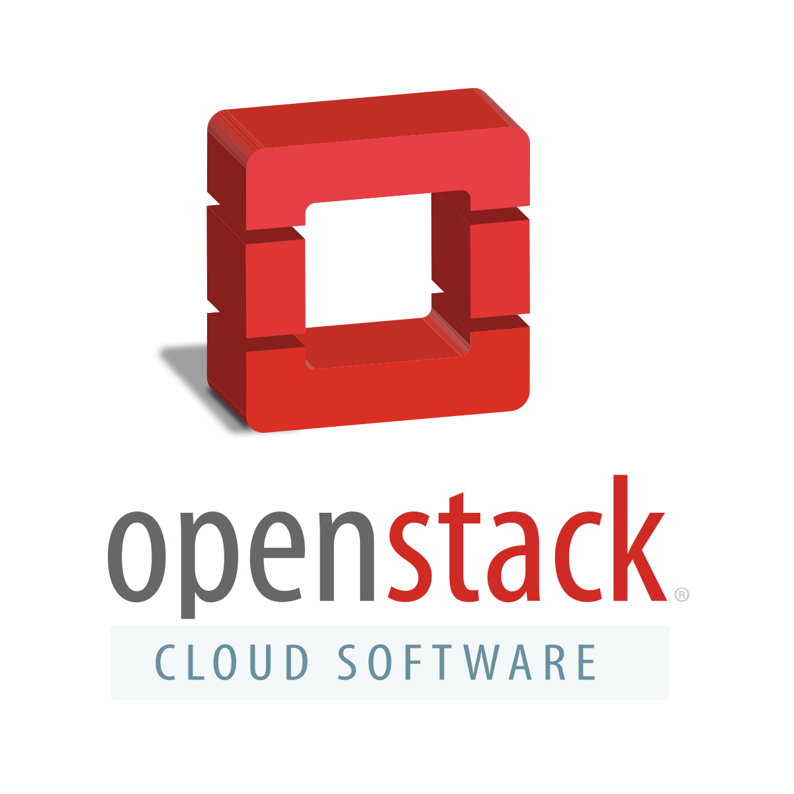
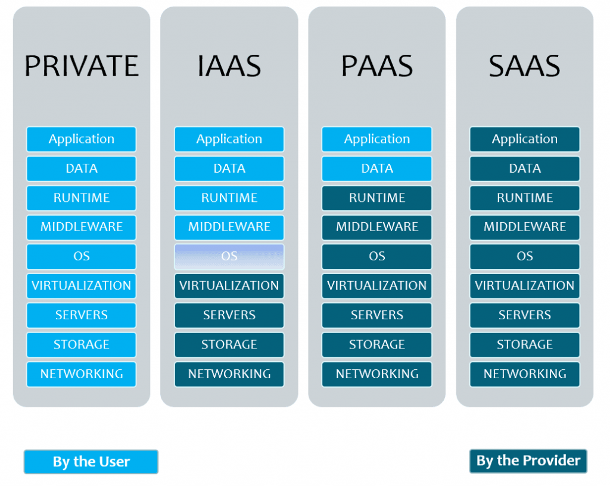

# Curs 2020-2021
# Projecte elaborat per:
Mati Vizcaíno Sánchez
# Escola:
Institut escola del treball - Departament d'informàtica
# Cicle formatiu de grau superior: 
Administració de sistemes informàtics i xarxes

# Continguts

1. [Com utilitzar Microstack](documentacio.md)
	* Llista de serveis
	* Ordres openstack (microstack)
		* Administrar imatges
		* Administrar volums
		* Administrar instancies
		* Administrar la xarxa
		* Administrar la identitat
		* Altres ordres útils d'administracio
	* Accés via web a Openstack

1. [Instalacio Openstack (Microstack)](instalacio.md)
	* Explicació microstack
	* Requisits necessaris
	* IP del server
	* Instalació pas a pas
1. [Com posar en marxa una maquina virtual amb microstack](demo.md)

# Introducció
Openstack és la suma de diversos components que tenen una funció específica i que pots instal·lar de manera separada o conjunta segons la distribució que triïs. És totalment modular, pots triar que instal·lar i que no.

**Saas (Software as a service):** Ofereixen una aplicació en el núvol com a servei. En el cas del Saas tens milers d'exemples: Gmail, Office 365, Outlook, Skype…

**Paas (Platform as a service):** Ofereix un entorn com a servei, pensat principalment per a desenvolupadors: Red hat OpenShift, Google App Engine.

**Iaas (Infrastructure as a service):** Ofereixen infraestructures d'emmagatzematge i màquines virtuals en el núvol. És a dir la infraestructura necessària per a muntar qualsevol dels altres dos serveis.

# Funcionament

1. L'usuari accedeix al panell web de Horizon i fa loggin, entra en joc Keystone per a autenticar l'usuari i donar-li els permisos corresponents.

1. Després l'usuari consulta gràcies a Glance la llista d'imatges disponibles i Nova la desplega segons les característiques de computament que l'usuari necessiti.

1. Neutron li posa la xarxa i Cinder l'emmagatzema i la màgia fa que en qüestió de segons tinguis la teva màquina disponible.

Aquest serie un funcionament bàsic dels components d'openstack "necessaris"

# Característiques
* **User friendly:** L'administrador no necessita intervenir quan un usuari necessita desplegar instàncies. Ho pot fer tot de manera autònoma i senzilla. Muntar-ho i deixar-ho funcionant és una altra història.

* **Escalable:** Usa el que necessitis. De fet més que escalable Openstack ho defineix com a elàstic. Els recursos que necessitis te'ls dóna en qüestió de segons de manera que poden augmentar o disminuir segons et convingui, la qual cosa va unit al concepte de pagament per ús.

* **Codi obert:** No sols significa gratis, significa que qualsevol pot aportar i consultar el codi. Té una llicencia Apache 2.0 i no té versió de pagament, encara que hi ha empreses que si cobren pel suport o l'ús del seu sistema operatiu. Per exemple *Red Hat Openstack.*

Com això és programari lliure cada empresa pot agafar els mòduls i fer el que vulgui amb ells per a oferir-los al seu client.

