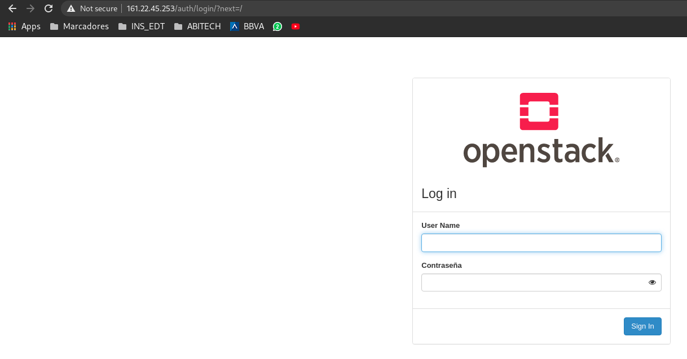
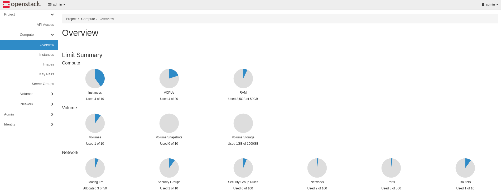
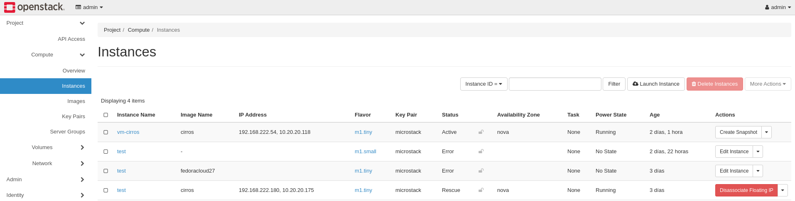
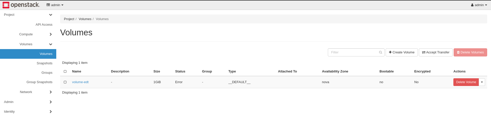
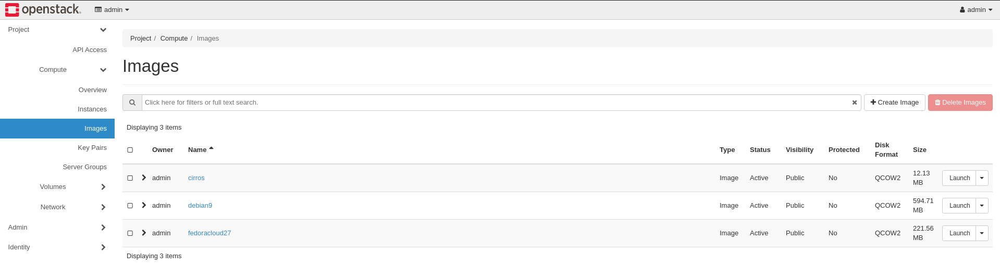

# Documentació

Openstack es una plataforma de computació al cloud de codi obert que admet 
tot tipus de entorns. Es una implementacio simple, amb escalabilitat 
massiva i un conjunt extens de caracteristiques. Proporciona solucions 
de IaaS *(Infrastructure as a Service)* a través d'una varietat de serveis. 
Cada servei ofereix una interficie de programació d'aplicacions *(API)* que facilita 
la integració.

A continuació la llista de serveis i les seves respectives API:

### Serveis
* Telemetry Alarming services (aodh)
* Key Manager service (barbican)
* Resource reservation service (blazar)
* Telemetry Data Collection service (ceilometer)
* **Block Storage service (cinder)**
* Rating service (cloudkitty)
* DNS service (designate)
* **Image service (glance)**
* Orchestration service (heat)
* **Dashboard (horizon)**
* Bare Metal service (ironic)
* **Identity service (keystone)**
* Shared File Systems service (manila)
* Application Catalog service (murano)
* **Networking service (neutron)**
* **Compute service (nova)**
* Load-balancer service (octavia)
* Placement service (placement)
* Data Processing service (sahara)
* Clustering service (senlin)
* Software Development Lifecycle Automation service (solum)
* Object Storage service (swift)
* NFV Orchestration service (tacker)
* Database service (trove)
* Containers service (zun) 


# Utilitzant microstack

## Ordres openstack (microstack)

* Disposem de ordres per poder **consultar,afegir o esborrar imatges, instancies, xarxes...***

Per engegar una instancia amb tot per defecte, es una instrucció sencilla:

```
microstack launch <imatge> --name <nom>
```


Amb l'ordre següent podem veure els components que utilitza openstack per funcionar amb la versió de microstack.

```
root@microstack-v2:~# microstack.openstack catalog list
+-----------+-----------+---------------------------------------------------------------------------+
| Name      | Type      | Endpoints                                                                 |
+-----------+-----------+---------------------------------------------------------------------------+
| keystone  | identity  | microstack                                                                |
|           |           |   admin: http://161.22.45.253:5000/v3/                                    |
|           |           | microstack                                                                |
|           |           |   internal: http://161.22.45.253:5000/v3/                                 |
|           |           | microstack                                                                |
|           |           |   public: http://161.22.45.253:5000/v3/                                   |
|           |           |                                                                           |
| placement | placement | microstack                                                                |
|           |           |   internal: http://161.22.45.253:8778                                     |
|           |           | microstack                                                                |
|           |           |   admin: http://161.22.45.253:8778                                        |
|           |           | microstack                                                                |
|           |           |   public: http://161.22.45.253:8778                                       |
|           |           |                                                                           |
| cinderv2  | volumev2  | microstack                                                                |
|           |           |   public: http://161.22.45.253:8776/v2/773932d230804fbfbc39b88bca6d70fe   |
|           |           | microstack                                                                |
|           |           |   admin: http://161.22.45.253:8776/v2/773932d230804fbfbc39b88bca6d70fe    |
|           |           | microstack                                                                |
|           |           |   internal: http://161.22.45.253:8776/v2/773932d230804fbfbc39b88bca6d70fe |
|           |           |                                                                           |
| glance    | image     | microstack                                                                |
|           |           |   internal: http://161.22.45.253:9292                                     |
|           |           | microstack                                                                |
|           |           |   public: http://161.22.45.253:9292                                       |
|           |           | microstack                                                                |
|           |           |   admin: http://161.22.45.253:9292                                        |
|           |           |                                                                           |
| nova      | compute   | microstack                                                                |
|           |           |   public: http://161.22.45.253:8774/v2.1                                  |
|           |           | microstack                                                                |
|           |           |   admin: http://161.22.45.253:8774/v2.1                                   |
|           |           | microstack                                                                |
|           |           |   internal: http://161.22.45.253:8774/v2.1                                |
|           |           |                                                                           |
| cinderv3  | volumev3  | microstack                                                                |
|           |           |   internal: http://161.22.45.253:8776/v3/773932d230804fbfbc39b88bca6d70fe |
|           |           | microstack                                                                |
|           |           |   admin: http://161.22.45.253:8776/v3/773932d230804fbfbc39b88bca6d70fe    |
|           |           | microstack                                                                |
|           |           |   public: http://161.22.45.253:8776/v3/773932d230804fbfbc39b88bca6d70fe   |
|           |           |                                                                           |
| neutron   | network   | microstack                                                                |
|           |           |   admin: http://161.22.45.253:9696                                        |
|           |           | microstack                                                                |
|           |           |   public: http://161.22.45.253:9696                                       |
|           |           | microstack                                                                |
|           |           |   internal: http://161.22.45.253:9696                                     |
|           |           |                                                                           |
+-----------+-----------+---------------------------------------------------------------------------+

```

## Administrar les imatges (*glance*)

* Llistar imatges disponibles

```
root@microstack-v2:~# microstack.openstack image list
+--------------------------------------+---------------+--------+
| ID                                   | Name          | Status |
+--------------------------------------+---------------+--------+
| ccc60c5d-a19c-41eb-9f98-70cd5d62c700 | cirros        | active |
| 9ede85cc-9deb-42df-8712-c371f93a3943 | debian9       | active |
| aa178bbd-68e9-4729-80aa-fd5ad4842c5b | fedoracloud27 | active |
+--------------------------------------+---------------+--------+

```

* Mostrar detall d'una imatge

```
root@microstack-v2:~# microstack.openstack image show debian9
+------------------+--------------------------------------------------------------------------------------------------------------------------------------------------------------------------------------------+
| Field            | Value                                                                                                                                                                                      |
+------------------+--------------------------------------------------------------------------------------------------------------------------------------------------------------------------------------------+
| checksum         | bc3186a64e3c0a4c75b71512fd2933ef                                                                                                                                                           |
| container_format | bare                                                                                                                                                                                       |
| created_at       | 2021-05-14T12:00:21Z                                                                                                                                                                       |
| disk_format      | qcow2                                                                                                                                                                                      |
| file             | /v2/images/9ede85cc-9deb-42df-8712-c371f93a3943/file                                                                                                                                       |
| id               | 9ede85cc-9deb-42df-8712-c371f93a3943                                                                                                                                                       |
| min_disk         | 10                                                                                                                                                                                         |
| min_ram          | 1024                                                                                                                                                                                       |
| name             | debian9                                                                                                                                                                                    |
| owner            | 773932d230804fbfbc39b88bca6d70fe                                                                                                                                                           |
| properties       | os_hash_algo='sha512', os_hash_value='23901bfb6717276d7da47e1e33a5dbc1a431eb330d3e8cf079b1bcf1b0e0320e37f44f2a913d5af75b9a43ffc6b17861a1df17169fd3883234c8bace87ff8118', os_hidden='False' |
| protected        | False                                                                                                                                                                                      |
| schema           | /v2/schemas/image                                                                                                                                                                          |
| size             | 623603712                                                                                                                                                                                  |
| status           | active                                                                                                                                                                                     |
| tags             |                                                                                                                                                                                            |
| updated_at       | 2021-05-14T12:00:28Z                                                                                                                                                                       |
| visibility       | public                                                                                                                                                                                     |
+------------------+--------------------------------------------------------------------------------------------------------------------------------------------------------------------------------------------+

```

* Crear i visualitzar plantilles de hardware

```
root@microstack-v2:~# microstack.openstack flavor create --ram 512 --disk 1 --vcpus 1 m1.mytiny
+----------------------------+--------------------------------------+
| Field                      | Value                                |
+----------------------------+--------------------------------------+
| OS-FLV-DISABLED:disabled   | False                                |
| OS-FLV-EXT-DATA:ephemeral  | 0                                    |
| disk                       | 1                                    |
| id                         | ac93701d-f60b-4766-9992-94bf42f8fb49 |
| name                       | m1.mytiny                            |
| os-flavor-access:is_public | True                                 |
| properties                 |                                      |
| ram                        | 512                                  |
| rxtx_factor                | 1.0                                  |
| swap                       |                                      |
| vcpus                      | 1                                    |
+----------------------------+--------------------------------------+
root@microstack-v2:~# microstack.openstack flavor list
+--------------------------------------+-----------+-------+------+-----------+-------+-----------+
| ID                                   | Name      |   RAM | Disk | Ephemeral | VCPUs | Is Public |
+--------------------------------------+-----------+-------+------+-----------+-------+-----------+
| 1                                    | m1.tiny   |   512 |    1 |         0 |     1 | True      |
| 2                                    | m1.small  |  2048 |   20 |         0 |     1 | True      |
| 3                                    | m1.medium |  4096 |   20 |         0 |     2 | True      |
| 4                                    | m1.large  |  8192 |   20 |         0 |     4 | True      |
| 5                                    | m1.xlarge | 16384 |   20 |         0 |     8 | True      |
| ac93701d-f60b-4766-9992-94bf42f8fb49 | m1.mytiny |   512 |    1 |         0 |     1 | True      |
+--------------------------------------+-----------+-------+------+-----------+-------+-----------+

```

## Administracio de volums (*Cinder*)

* Crear un volum

```
$ openstack volume create --size SIZE_IN_GB NAME
```

**Exemple:**

```
root@microstack-v2:~# microstack.openstack volume create --size 1 volume-edt
+---------------------+--------------------------------------+
| Field               | Value                                |
+---------------------+--------------------------------------+
| attachments         | []                                   |
| availability_zone   | nova                                 |
| bootable            | false                                |
| consistencygroup_id | None                                 |
| created_at          | 2021-05-17T08:30:19.000000           |
| description         | None                                 |
| encrypted           | False                                |
| id                  | 73b620ef-496f-462c-b4a8-f26d4e85489e |
| migration_status    | None                                 |
| multiattach         | False                                |
| name                | volume-edt                           |
| properties          |                                      |
| replication_status  | None                                 |
| size                | 1                                    |
| snapshot_id         | None                                 |
| source_volid        | None                                 |
| status              | creating                             |
| type                | __DEFAULT__                          |
| updated_at          | None                                 |
| user_id             | 3687bc329d8c4801905a57f2c6db6a49     |
+---------------------+--------------------------------------+
```

* Llistar els volums

```
$ openstack volume list
```

**Exemple:**

```
root@microstack-v2:~# microstack.openstack volume list
+--------------------------------------+------------+--------+------+-------------+
| ID                                   | Name       | Status | Size | Attached to |
+--------------------------------------+------------+--------+------+-------------+
| 73b620ef-496f-462c-b4a8-f26d4e85489e | volume-edt |  error |    1 |             |
+--------------------------------------+------------+--------+------+-------------+

```

* Afegir un volum a una instancia

```
$ openstack server add volume INSTANCE_ID VOLUME_ID
```

```
root@microstack-v2:~# microstack.openstack server add volume edf71082-4c50-4537-96fd-ec7ec712fd56 volume-edt
Invalid input received: Invalid volume: Volume attachments can not be created if the volume is in an error
state. The Volume 73b620ef-496f-462c-b4a8-f26d4e85489e currently has a status of: error  (HTTP 400)
(Request-ID: req-8923e0fe-8712-4bc0-979c-6552a0f8b845) 
(HTTP 400) (Request-ID: req-17912451-8675-42a0-8011-d1a779a4eefd)
```

*Degut a que el volum anterior s'ha creat amb estat d'error, no he pogut afegir-lo a la instancia*

* Visualitzar zona de creacio d'un volum

```
root@microstack-v2:~# microstack.openstack availability zone list
+-----------+-------------+
| Zone Name | Zone Status |
+-----------+-------------+
| internal  | available   |
| nova      | available   |
+-----------+-------------+

```

* Veure detalls d'un volum

```
$ openstack volume show VOLUME_ID
```

**Exemple:**

```
root@microstack-v2:~# microstack.openstack volume show volume-edt
+--------------------------------+--------------------------------------+
| Field                          | Value                                |
+--------------------------------+--------------------------------------+
| attachments                    | []                                   |
| availability_zone              | nova                                 |
| bootable                       | false                                |
| consistencygroup_id            | None                                 |
| created_at                     | 2021-05-17T08:30:19.000000           |
| description                    | None                                 |
| encrypted                      | False                                |
| id                             | 73b620ef-496f-462c-b4a8-f26d4e85489e |
| migration_status               | None                                 |
| multiattach                    | False                                |
| name                           | volume-edt                           |
| os-vol-host-attr:host          | None                                 |
| os-vol-mig-status-attr:migstat | None                                 |
| os-vol-mig-status-attr:name_id | None                                 |
| os-vol-tenant-attr:tenant_id   | 773932d230804fbfbc39b88bca6d70fe     |
| properties                     |                                      |
| replication_status             | None                                 |
| size                           | 1                                    |
| snapshot_id                    | None                                 |
| source_volid                   | None                                 |
| status                         | error                                |
| type                           | __DEFAULT__                          |
| updated_at                     | 2021-05-17T08:30:19.000000           |
| user_id                        | 3687bc329d8c4801905a57f2c6db6a49     |
+--------------------------------+--------------------------------------+
```

### Administracio de la instancia (*Nova*)

* Crear una instancia

```
microstack.opentack server create INSTANCE_ID
```

*sense especificacions*

* Esborrar una instancia

```
microstack.opentack server delete INSTANCE_ID
```

* Visualitzar les instancies que tenim 

```
root@microstack-v2:~# microstack.openstack server list
+--------------------------------------+-----------+--------+------------------------------------+---------------+----------+
| ID                                   | Name      | Status | Networks                           | Image         | Flavor   |
+--------------------------------------+-----------+--------+------------------------------------+---------------+----------+
| b76e2e25-e7e0-453e-a740-8aabe411a258 | vm-cirros | ACTIVE | test=192.168.222.54, 10.20.20.118  | cirros        | m1.tiny  |
| 562d8831-d269-4005-acb4-3c32c8178415 | test      | ERROR  |                                    |               | m1.small |
| 1fc4b2a1-ce36-41a4-a272-205b90a37205 | test      | ERROR  |                                    | fedoracloud27 | m1.tiny  |
| edf71082-4c50-4537-96fd-ec7ec712fd56 | test      | ACTIVE | test=192.168.222.180, 10.20.20.175 | cirros        | m1.tiny  |
+--------------------------------------+-----------+--------+------------------------------------+---------------+----------+
```

* Pausar i treure la pausa a la instancia

```
$ microstack.openstack server pause vm-cirros
```

```
$ microstack.openstack server unpause vm-cirros
```
* Posar en suspensio i renaudar la instancia

```
$ microstack.openstack server suspend vm-cirros
```

```
$ microstack.openstack server resume vm-cirros
```

* Aturar i engegar la instancia

```
$ microstack.openstack server stop vm-cirros
```

```
$ microstack.openstack server start vm-cirros
```

* Recuperar una instancia a partir d'una imatge

```
$ microstack.openstack server rescue --image cirros vm-cirros
```


* Redimensionar la instancia amb un altre tamany

```
$ microstack.openstack server resize vm-cirros m1.mytiny
```

* Rebotar la instancia

```
$ microstack.openstack server reboot NAME
```

* Accedir a una instancia desde Openstack amb ssh

```
root@microstack-v2:~# microstack.openstack server ssh --login cirros --identity /home/root/snap/microstack/common/.ssh/id_microstack vm-cirros
$ uname -a 
Linux vm-cirros 4.4.0-28-generic #47-Ubuntu SMP Fri Jun 24 10:09:13 UTC 2016 x86_64 GNU/Linux
$ pwd
/home/cirros
$ 

```

## Administracio de la xarxa (*neutron*)

* Crear una xarxa

```
$ microstack.openstack network create NETWORK_NAME
```

* Crear subxarxa 

```
$ microstack.openstack subnet create --subnet-pool SUBNET --network NETWORK SUBNET_NAME
```

## Administracio d'identitat (*keystone*)

*En aquest projecte aquest component nomes l'he utilitzar per obtenir les credencials per accedir via web al panell de gestió  d'OpenStack*

* Obtenir la password de admin

```
sudo snap get microstack config.credentials.keystone-password
```
La sortida d'aquesta ordre es la password per accedir al frontend d'OpenStack

```
DlQhO08prtwkAVQclU9NG0HxVbbwGRix
```

### Altres posibilitats d'administracio

* **Afegir objectes**
	*  ```microstack.openstack server add fixed ip```
	*  ```microstack.openstack server add floating ip```
	*  ```microstack.openstack server add network```
	*  ```microstack.openstack server add port```
	*  ```microstack.openstack server add security group```
	*  ```microstack.openstack server add volume```

* **Esborrar objectes**
	*  ```microstack.openstack server remove fixed ip```
	*  ```microstack.openstack server remove floating ip```
	*  ```microstack.openstack server remove network```
	*  ```microstack.openstack server remove port```
	*  ```microstack.openstack server remove security group```
	*  ```microstack.openstack server remove volume```
* **Crear un backup**
	*  ```microstack.openstack server backup create```

* **Administracio de grups**
	*  ```microstack.openstack server group create```
	*  ```microstack.openstack server group delete```
	*  ```microstack.openstack server group list```
	*  ```microstack.openstack server group show```


## Acces vía web a Openstack (*horizon*)



Per monitoritzar els resursos o administrar els components d'Openstack amb una eina grafica, ens ofereix una connexio via web amb autenticacio amb usuari i contrasenya.



Podem observar els recursos que s'estan consumint, i amb el grafic circular i el tant per cent ens indica quanta capacitat li queda.

També es pot administrar instancies des d'aquest panell

# Instancies 


# Volums


# Imatges


Amb *horizon* podem administrar gairabé tot el que administrem via comandes amb clicks de ratolí. Una forma més sencilla pero és mes facil que doni errors.


[Torna](README.md)


